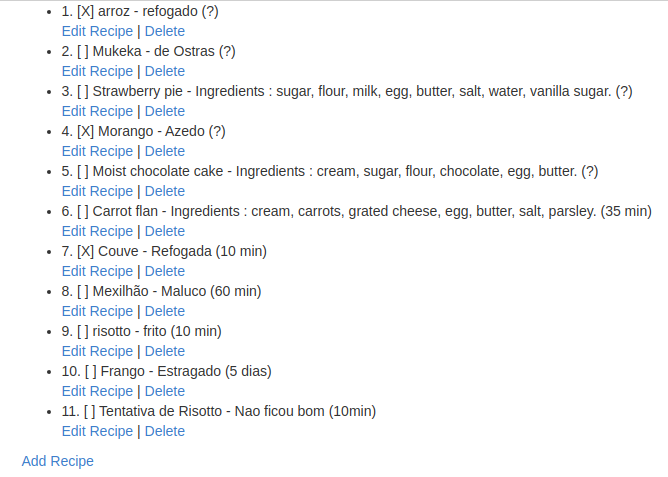

# Cookbook

A simple CRUD app.
- See list of recipes
- Write new recipe.

(pending view implementation)
- Edit recipes.
- Mark recipe as done.
- Delete recipes.

Run 'bundle install' and 'ruby app.rb' to run the app.

Project developed @ Le Wagon Bootcamp.

> Screenshot


-------------------------------------

## Some words about Sinatra

Sinatra is what we call a web "microframework". It's basically a micro Rails also following the **MVC** pattern.
The `app.rb` file acts as the controller. The router layer is handled by Sinatra.

Read more about Sinatra in our homemade [tutorial](https://github.com/lewagon/sinatra-101). Follow the [setup](https://github.com/lewagon/sinatra-101#setup), [sinatra app](https://github.com/lewagon/sinatra-101#sinatra-app) and [views](https://github.com/lewagon/sinatra-101#views) steps thoroughly before starting your Cookbook web app.

## Features

### Index

At the root of your web app (at the `/` url), you should display your cookbook's recipes in an unordered list.

Under the list of recipes, add a navigation link (`<a>`) to the `/new` url, that we'll use for the `create` user story.

### Create

Creating a new recipe takes two steps in the context of our web app. We need one step to display a form. We'll use a `GET /new` HTTP request to display the form.

The `<form>` will be the equivalent of the `gets` in the terminal. We need fields for the recipe's name, description, and any other field you find relevant to add. Submitting this form should trigger the following HTTP request:

```
POST /recipes
```

This request should trigger some code in `app.rb` to add the recipe in the cookbook.
At the end of this code, find a way to **redirect** the user to the `/` url of your web app (the index).

### Destroy

In your index, add a `destroy` link next to the name and the description of the recipe.
Clicking on the link should remove it from the cookbook and **redirect** to the index.


### Going further

When you managed to code these 3 user stories, go on and try to implement the harder `import` and `mark as done` actions!
